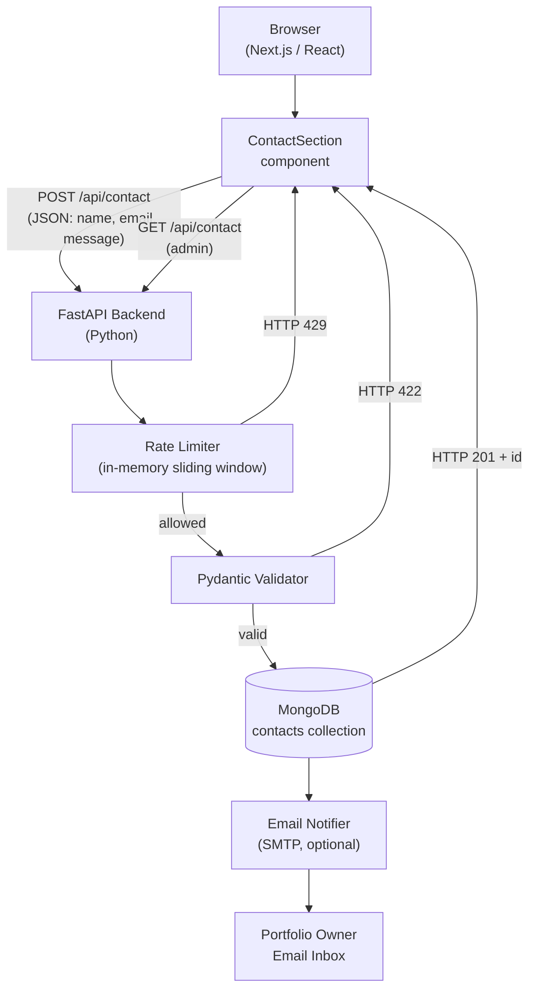

# Design Document: Portfolio Contact System

## Overview

This document describes the technical design for a production-ready, full-stack contact system that replaces the mock `setTimeout` in the existing `ContactSection` React component with a live FastAPI backend, MongoDB persistence, rate limiting, CORS middleware, and optional email notifications.

The system has two main parts:

1. **FastAPI backend** — a standalone Python service that exposes `POST /api/contact` (submit a message) and `GET /api/contact` (admin retrieval). It runs independently of the Next.js frontend and is deployed separately (e.g., Render or Railway).
2. **Next.js frontend** — the existing `ContactSection` component, updated to call the real backend, handle loading/success/error states, and surface rate-limit feedback.

### Goals

- Accept, validate, and persist contact form submissions.
- Protect the endpoint from spam via per-IP rate limiting.
- Notify the portfolio owner via email (optional, config-driven).
- Keep the frontend and backend loosely coupled through a stable JSON API contract.
- Make the system easy to deploy, configure, and maintain.

---

## Architecture



### Key Design Decisions

| Decision | Choice | Rationale |
|---|---|---|
| Backend framework | FastAPI | Async-native, Pydantic integration, auto-generated OpenAPI docs |
| Database | MongoDB via Motor (async) | Schema-flexible, easy to host on Atlas free tier |
| Rate limiting | In-memory sliding window | No Redis dependency; sufficient for a personal portfolio |
| Email | `aiosmtplib` + stdlib `email` | Lightweight, async, no third-party email SDK required |
| Config loading | `pydantic-settings` | Type-safe env loading with clear missing-variable errors |
| Frontend HTTP | Native `fetch` | No new dependency; axios already present but fetch is simpler for this use case |

---

## Components and Interfaces

### Backend Module Structure

```
backend/
├── main.py              # App factory, middleware registration, lifespan
├── database.py          # Motor client, connection helpers
├── schemas.py           # Pydantic request/response models
├── models.py            # DB helper functions (insert, find_all)
├── config.py            # pydantic-settings Environment_Config
├── rate_limiter.py      # Sliding-window rate limiter
├── email_notifier.py    # Optional SMTP notification
├── routes/
│   └── contact.py       # Route handlers for /api/contact
├── requirements.txt     # Pinned Python dependencies
├── .env.example         # Documented environment variable template
└── .env                 # Runtime secrets (gitignored)
```

### `main.py` — Application Entry Point

```python
from contextlib import asynccontextmanager
from fastapi import FastAPI
from fastapi.middleware.cors import CORSMiddleware
from .config import settings
from .database import connect_db, close_db
from .routes.contact import router as contact_router

@asynccontextmanager
async def lifespan(app: FastAPI):
    await connect_db()
    yield
    await close_db()

app = FastAPI(lifespan=lifespan)

app.add_middleware(
    CORSMiddleware,
    allow_origins=settings.allowed_origins,
    allow_methods=["GET", "POST", "OPTIONS"],
    allow_headers=["Content-Type", "Authorization"],
)

app.include_router(contact_router, prefix="/api")
```

### `database.py` — MongoDB Connection

```python
from motor.motor_asyncio import AsyncIOMotorClient
from .config import settings

_client: AsyncIOMotorClient | None = None

async def connect_db() -> None:
    global _client
    _client = AsyncIOMotorClient(settings.mongo_uri)
    # Ping to verify connection
    await _client.admin.command("ping")

async def close_db() -> None:
    if _client:
        _client.close()

def get_db():
    return _client[settings.db_name]
```

### `schemas.py` — Pydantic Models

```python
from pydantic import BaseModel, EmailStr, field_validator
from datetime import datetime

class ContactRequest(BaseModel):
    name: str
    email: EmailStr
    message: str

    @field_validator("name")
    @classmethod
    def name_not_blank(cls, v: str) -> str:
        if not v.strip():
            raise ValueError("name must not be blank")
        if len(v) > 100:
            raise ValueError("name must not exceed 100 characters")
        return v

    @field_validator("message")
    @classmethod
    def message_not_blank(cls, v: str) -> str:
        if not v.strip():
            raise ValueError("message must not be blank")
        if len(v) > 5000:
            raise ValueError("message must not exceed 5000 characters")
        return v

class ContactResponse(BaseModel):
    success: bool
    message: str
    id: str | None = None

class ContactDocument(BaseModel):
    id: str
    name: str
    email: str
    message: str
    created_at: datetime
```

### `models.py` — Database Helpers

```python
from datetime import datetime, timezone
from bson import ObjectId
from .database import get_db

async def insert_contact(name: str, email: str, message: str) -> str:
    doc = {
        "name": name,
        "email": email,
        "message": message,
        "created_at": datetime.now(timezone.utc),
    }
    result = await get_db()["contacts"].insert_one(doc)
    return str(result.inserted_id)

async def find_all_contacts() -> list[dict]:
    cursor = get_db()["contacts"].find().sort("created_at", -1)
    docs = await cursor.to_list(length=None)
    for doc in docs:
        doc["id"] = str(doc.pop("_id"))
    return docs
```

### `rate_limiter.py` — Sliding Window

```python
import time
from collections import defaultdict, deque
from fastapi import Request, HTTPException

RATE_LIMIT = 5        # max requests
WINDOW_SECS = 60      # sliding window in seconds

_request_log: dict[str, deque] = defaultdict(deque)

def check_rate_limit(request: Request) -> None:
    ip = request.client.host
    now = time.monotonic()
    window = _request_log[ip]

    # Evict timestamps outside the window
    while window and now - window[0] > WINDOW_SECS:
        window.popleft()

    if len(window) >= RATE_LIMIT:
        raise HTTPException(
            status_code=429,
            detail={"success": False, "message": "Too many requests. Please try again later."},
        )

    window.append(now)
```

### `email_notifier.py` — Optional SMTP

```python
import aiosmtplib
from email.message import EmailMessage
from .config import settings
import logging

logger = logging.getLogger(__name__)

async def send_notification(name: str, email: str, message: str) -> None:
    if not settings.email_enabled:
        return
    msg = EmailMessage()
    msg["From"] = settings.smtp_user
    msg["To"] = settings.notify_email
    msg["Subject"] = f"New contact from {name}"
    msg.set_content(f"Name: {name}\nEmail: {email}\n\nMessage:\n{message}")
    try:
        await aiosmtplib.send(
            msg,
            hostname=settings.smtp_host,
            port=settings.smtp_port,
            username=settings.smtp_user,
            password=settings.smtp_password,
            start_tls=True,
        )
    except Exception as exc:
        logger.error("Failed to send notification email: %s", exc)
```

### `routes/contact.py` — Route Handlers

```python
from fastapi import APIRouter, Depends, Request
from ..schemas import ContactRequest, ContactResponse, ContactDocument
from ..models import insert_contact, find_all_contacts
from ..rate_limiter import check_rate_limit
from ..email_notifier import send_notification
import logging

logger = logging.getLogger(__name__)
router = APIRouter()

@router.post("/contact", response_model=ContactResponse, status_code=201)
async def submit_contact(
    payload: ContactRequest,
    request: Request,
    _: None = Depends(check_rate_limit),
):
    inserted_id = await insert_contact(payload.name, payload.email, payload.message)
    await send_notification(payload.name, payload.email, payload.message)
    return ContactResponse(success=True, message="Message sent successfully", id=inserted_id)

@router.get("/contact", response_model=list[ContactDocument], status_code=200)
async def get_contacts():
    return await find_all_contacts()
```

### Frontend `ContactSection` Integration

The existing component's `handleSubmit` mock is replaced with a real `fetch` call:

```typescript
const [error, setError] = useState<string | null>(null);

const handleSubmit = async (e: React.FormEvent) => {
  e.preventDefault();
  setIsSubmitting(true);
  setError(null);

  try {
    const res = await fetch(
      `${process.env.NEXT_PUBLIC_API_URL}/api/contact`,
      {
        method: "POST",
        headers: { "Content-Type": "application/json" },
        body: JSON.stringify(formData),
      }
    );
    const data = await res.json();

    if (!res.ok) {
      // 422, 429, 500 all carry { success: false, message: "..." }
      setError(data.message ?? "Something went wrong. Please try again.");
      return;
    }

    setIsSuccess(true);
    setFormData({ name: "", email: "", message: "" });
    setTimeout(() => setIsSuccess(false), 3000);
  } catch {
    setError("Network error. Please check your connection and try again.");
  } finally {
    setIsSubmitting(false);
  }
};
```

An error banner is rendered below the submit button when `error` is non-null:

```tsx
{error && (
  <motion.div
    initial={{ opacity: 0, y: -10 }}
    animate={{ opacity: 1, y: 0 }}
    className="p-4 rounded-lg bg-red-500/10 border border-red-500/20 text-red-400 text-center"
  >
    {error}
  </motion.div>
)}
```

---

## Data Models

### MongoDB `contacts` Collection Schema

Each document stored in the `contacts` collection has the following shape:

```json
{
  "_id":        ObjectId("..."),
  "name":       "Jane Doe",
  "email":      "jane@example.com",
  "message":    "Hello, I'd like to discuss a project.",
  "created_at": ISODate("2025-01-15T10:30:00.000Z")
}
```

| Field | BSON Type | Constraints | Notes |
|---|---|---|---|
| `_id` | ObjectId | auto-generated | Serialized as string `id` in API responses |
| `name` | String | 1–100 chars, non-blank | Validated by Pydantic before insert |
| `email` | String | RFC 5322 format | Validated by `EmailStr` |
| `message` | String | 1–5000 chars, non-blank | Validated by Pydantic before insert |
| `created_at` | Date (UTC) | auto-set at insert | Set by `models.py`, not by client |

### Indexes

```javascript
// Descending index on created_at to support the default sort in GET /api/contact
db.contacts.createIndex({ created_at: -1 })
```

### API Response Shapes

**POST /api/contact — 201 Created**
```json
{ "success": true, "message": "Message sent successfully", "id": "64f1a2b3c4d5e6f7a8b9c0d1" }
```

**POST /api/contact — 422 Unprocessable Entity**
```json
{ "success": false, "message": "value is not a valid email address" }
```

**POST /api/contact — 429 Too Many Requests**
```json
{ "success": false, "message": "Too many requests. Please try again later." }
```

**POST /api/contact — 500 Internal Server Error**
```json
{ "success": false, "message": "Internal server error" }
```

**GET /api/contact — 200 OK**
```json
[
  {
    "id": "64f1a2b3c4d5e6f7a8b9c0d1",
    "name": "Jane Doe",
    "email": "jane@example.com",
    "message": "Hello!",
    "created_at": "2025-01-15T10:30:00Z"
  }
]
```

### Environment Configuration

```
# .env.example

# Required
MONGO_URI=mongodb+srv://<user>:<password>@cluster.mongodb.net/  # MongoDB connection string
DB_NAME=portfolio                                                # Database name
ALLOWED_ORIGINS=http://localhost:3000,https://yourdomain.com    # Comma-separated allowed origins

# Optional — omit to disable email notifications
SMTP_HOST=smtp.gmail.com
SMTP_PORT=587
SMTP_USER=you@gmail.com
SMTP_PASSWORD=your_app_password
NOTIFY_EMAIL=you@gmail.com
```

`config.py` uses `pydantic-settings` to load and validate these at startup:

```python
from pydantic_settings import BaseSettings, SettingsConfigDict
from pydantic import field_validator
import sys, logging

logger = logging.getLogger(__name__)

class Settings(BaseSettings):
    model_config = SettingsConfigDict(env_file=".env", env_file_encoding="utf-8")

    mongo_uri: str
    db_name: str
    allowed_origins: list[str]

    smtp_host: str | None = None
    smtp_port: int | None = None
    smtp_user: str | None = None
    smtp_password: str | None = None
    notify_email: str | None = None

    @field_validator("allowed_origins", mode="before")
    @classmethod
    def parse_origins(cls, v):
        if isinstance(v, str):
            return [o.strip() for o in v.split(",")]
        return v

    @property
    def email_enabled(self) -> bool:
        return all([
            self.smtp_host, self.smtp_port,
            self.smtp_user, self.smtp_password,
            self.notify_email,
        ])

try:
    settings = Settings()
except Exception as exc:
    logger.critical("Missing required environment variable: %s", exc)
    sys.exit(1)
```

---

## Correctness Properties

*A property is a characteristic or behavior that should hold true across all valid executions of a system — essentially, a formal statement about what the system should do. Properties serve as the bridge between human-readable specifications and machine-verifiable correctness guarantees.*

The following properties were derived from the acceptance criteria. Each is universally quantified and suitable for property-based testing using [Hypothesis](https://hypothesis.readthedocs.io/) (Python).

---

### Property 1: Contact insertion round-trip preserves all fields

*For any* valid contact payload (non-blank name ≤ 100 chars, valid RFC 5322 email, non-blank message ≤ 5000 chars), calling `insert_contact` and then retrieving the document by the returned id SHALL yield a document containing the original `name`, `email`, and `message` values, a string `id`, and a `created_at` field that is a UTC datetime.

**Validates: Requirements 1.1, 1.2, 3.1**

---

### Property 2: Blank name or message fields are rejected by the validator

*For any* string composed entirely of whitespace characters (spaces, tabs, newlines, or the empty string), constructing a `ContactRequest` with that string as `name` or as `message` SHALL raise a `ValidationError`.

**Validates: Requirements 2.3, 2.4**

---

### Property 3: Fields exceeding maximum length are rejected by the validator

*For any* string whose length exceeds 100 characters when used as `name`, or exceeds 5000 characters when used as `message`, constructing a `ContactRequest` SHALL raise a `ValidationError`. Conversely, for any non-blank string within the respective limit, the validator SHALL accept it.

**Validates: Requirements 2.5, 2.6**

---

### Property 4: Invalid email addresses are rejected by the validator

*For any* string that does not conform to RFC 5322 email format (e.g., missing `@`, missing domain, bare local part), constructing a `ContactRequest` with that string as `email` SHALL raise a `ValidationError`.

**Validates: Requirements 2.2**

---

### Property 5: Requests missing required fields are rejected by the validator

*For any* request body that omits one or more of `name`, `email`, or `message`, constructing a `ContactRequest` SHALL raise a `ValidationError` that identifies the missing field(s).

**Validates: Requirements 2.1**

---

### Property 6: Rate limiter enforces the per-IP request threshold

*For any* IP address string, after exactly 5 calls to `check_rate_limit` within a 60-second window, the 6th call SHALL raise an `HTTPException` with status code 429. The first 5 calls SHALL succeed without raising.

**Validates: Requirements 6.1**

---

### Property 7: Rate limiter resets after the sliding window expires

*For any* IP address that has been rate-limited (≥ 5 requests in the window), advancing the mock clock by more than 60 seconds and then calling `check_rate_limit` again SHALL succeed without raising an exception.

**Validates: Requirements 6.2**

---

### Property 8: GET /api/contact returns documents sorted descending by created_at

*For any* collection of contact documents with distinct `created_at` timestamps, the list returned by `find_all_contacts` SHALL be ordered such that each document's `created_at` is greater than or equal to the `created_at` of the document that follows it (descending order).

**Validates: Requirements 4.1**

---

### Property 9: Email notification body contains all submitter fields

*For any* valid contact payload (name, email, message) when email notification is enabled, the `EmailMessage` constructed by `send_notification` SHALL contain the submitter's `name`, `email`, and `message` as substrings of the message body.

**Validates: Requirements 7.1, 7.2**

---

## Error Handling

### Validation Errors (HTTP 422)

FastAPI's default 422 response from Pydantic is overridden with a custom exception handler to match the `{ "success": false, "message": "..." }` contract:

```python
from fastapi import Request
from fastapi.exceptions import RequestValidationError
from fastapi.responses import JSONResponse

@app.exception_handler(RequestValidationError)
async def validation_exception_handler(request: Request, exc: RequestValidationError):
    first_error = exc.errors()[0]
    msg = first_error.get("msg", "Validation error")
    return JSONResponse(
        status_code=422,
        content={"success": False, "message": msg},
    )
```

### Rate Limit Errors (HTTP 429)

The `check_rate_limit` dependency raises `HTTPException(429)` with the standard error body. FastAPI's built-in `HTTPException` handler returns the `detail` dict directly as the response body.

### Database Errors (HTTP 500)

Route handlers wrap DB calls in try/except and return the standard error body:

```python
try:
    inserted_id = await insert_contact(...)
except Exception as exc:
    logger.exception("DB write failed: %s", exc)
    raise HTTPException(
        status_code=500,
        detail={"success": False, "message": "Internal server error"},
    )
```

### Startup Failures

- **Missing env vars**: `pydantic-settings` raises `ValidationError` at import time; `config.py` catches it, logs the missing field name, and calls `sys.exit(1)`.
- **MongoDB unreachable**: `connect_db()` pings the server; if the ping fails, the exception propagates out of the lifespan context manager, FastAPI logs it, and the process exits non-zero.

### Email Failures

`send_notification` catches all exceptions internally, logs them at `ERROR` level, and returns normally. The route handler is unaffected — it always returns HTTP 201 after a successful DB write regardless of email outcome.

### Frontend Error Handling

| HTTP Status | Frontend Behavior |
|---|---|
| 201 | Show success banner, clear form fields |
| 422 | Show `data.message` in red error banner, preserve form fields |
| 429 | Show "Too many requests. Please try again later." in red error banner |
| 500 | Show "Something went wrong. Please try again." in red error banner |
| Network error | Show "Network error. Please check your connection and try again." |

---

## Testing Strategy

### Overview

The testing strategy uses a dual approach:
- **Unit / property-based tests** for pure logic (validation, rate limiter, serialization, email construction)
- **Integration tests** for infrastructure wiring (DB connection, endpoint behavior end-to-end)

Property-based testing is appropriate here because the core logic (Pydantic validation, rate limiter, sort order, email body construction) consists of pure or near-pure functions with large input spaces where edge cases matter.

### Property-Based Testing

**Library**: [Hypothesis](https://hypothesis.readthedocs.io/) (Python)  
**Minimum iterations**: 100 per property (Hypothesis default; increase with `@settings(max_examples=200)` for critical properties)

Each property test is tagged with a comment referencing the design property:

```python
# Feature: portfolio-contact-system, Property 1: Contact insertion round-trip preserves all fields
@given(
    name=st.text(min_size=1, max_size=100).filter(lambda s: s.strip()),
    email=st.emails(),
    message=st.text(min_size=1, max_size=5000).filter(lambda s: s.strip()),
)
@settings(max_examples=100)
async def test_insert_round_trip(name, email, message):
    inserted_id = await insert_contact(name, email, message)
    doc = await get_db()["contacts"].find_one({"_id": ObjectId(inserted_id)})
    assert doc["name"] == name
    assert doc["email"] == email
    assert doc["message"] == message
    assert isinstance(doc["created_at"], datetime)
    assert doc["created_at"].tzinfo is not None  # UTC-aware
```

**Property test file structure:**

```
backend/tests/
├── test_properties.py     # All 9 property-based tests
├── test_unit.py           # Example-based unit tests
└── test_integration.py    # Integration tests (requires live MongoDB)
```

### Unit Tests (Example-Based)

Focus on specific scenarios not covered by property tests:

| Test | Scenario |
|---|---|
| `test_loading_state` | Submit button disabled + spinner visible during pending request |
| `test_success_state` | Success banner shown + fields cleared after 201 |
| `test_error_state` | Error banner shown + fields preserved after 422/429/500 |
| `test_db_write_failure` | Mock insert_one raises → endpoint returns 500 |
| `test_startup_missing_env` | Missing MONGO_URI → Settings raises ValidationError |
| `test_email_failure_non_fatal` | aiosmtplib.send raises → endpoint still returns 201 |
| `test_preflight_options` | OPTIONS request returns 200 with CORS headers |
| `test_empty_collection` | GET /api/contact with no docs returns [] |

### Integration Tests

Run against a real (or Docker-based) MongoDB instance:

| Test | What it verifies |
|---|---|
| `test_db_connection` | App starts and pings MongoDB successfully |
| `test_post_contact_e2e` | Full POST → DB insert → 201 response |
| `test_get_contact_e2e` | Full GET → sorted documents returned |
| `test_cors_allowed_origin` | Request from allowed origin receives CORS headers |

### Frontend Tests

Using **Vitest** + **React Testing Library** (already in the project ecosystem via Next.js):

```typescript
// Feature: portfolio-contact-system, Property — UI loading state
it("disables submit button while submitting", async () => {
  // mock fetch to return a never-resolving promise
  // submit form, assert button is disabled
});
```

---

## Deployment Considerations

### Backend Deployment (Render / Railway)

Both platforms support Python web services with environment variable injection.

**Render configuration (`render.yaml`):**
```yaml
services:
  - type: web
    name: portfolio-contact-api
    runtime: python
    buildCommand: pip install -r requirements.txt
    startCommand: uvicorn main:app --host 0.0.0.0 --port $PORT
    envVars:
      - key: MONGO_URI
        sync: false   # set in Render dashboard
      - key: DB_NAME
        value: portfolio
      - key: ALLOWED_ORIGINS
        sync: false   # set to production frontend URL
```

**Railway**: Add a `Procfile`:
```
web: uvicorn main:app --host 0.0.0.0 --port $PORT
```

### MongoDB Hosting

Use **MongoDB Atlas** free tier (M0). Steps:
1. Create a cluster and database user.
2. Whitelist `0.0.0.0/0` (or the backend service's static IP if available).
3. Copy the connection string into the `MONGO_URI` environment variable.

### CORS in Production

Set `ALLOWED_ORIGINS` to the exact production frontend URL (e.g., `https://yourportfolio.com`). Do not use `*` in production.

### Frontend Environment Variable

Add to the Next.js project's environment (`.env.local` for local dev, platform dashboard for production):

```
NEXT_PUBLIC_API_URL=https://portfolio-contact-api.onrender.com
```

### Health Check

Add a `/health` endpoint to `main.py` for platform health checks:

```python
@app.get("/health")
async def health():
    return {"status": "ok"}
```

### `requirements.txt` (pinned)

```
fastapi==0.115.5
uvicorn[standard]==0.32.1
motor==3.6.0
pydantic[email]==2.10.3
pydantic-settings==2.6.1
aiosmtplib==3.0.1
python-dotenv==1.0.1
```
